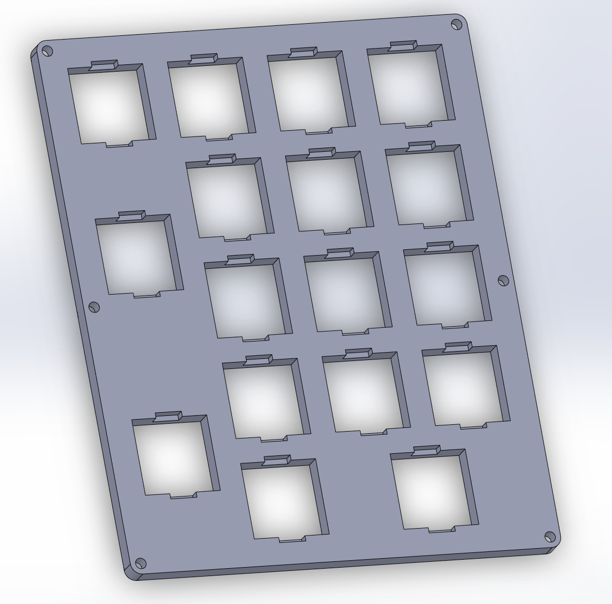
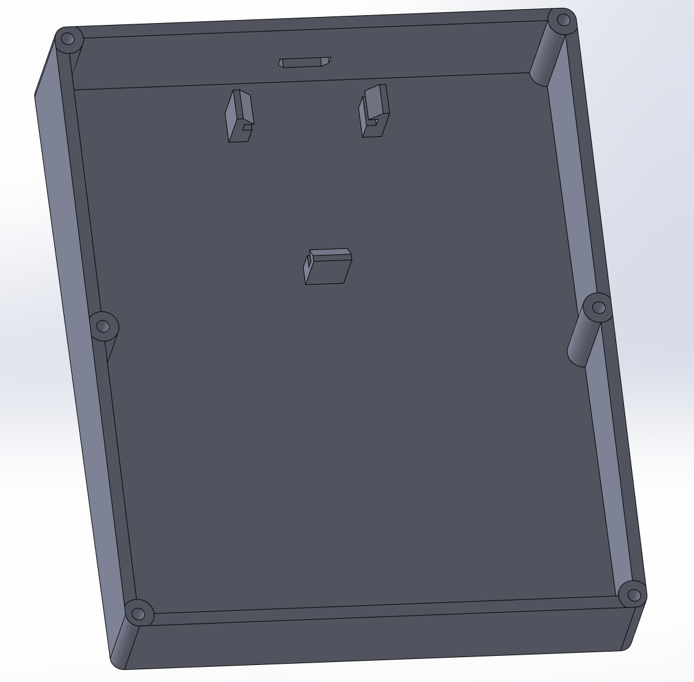
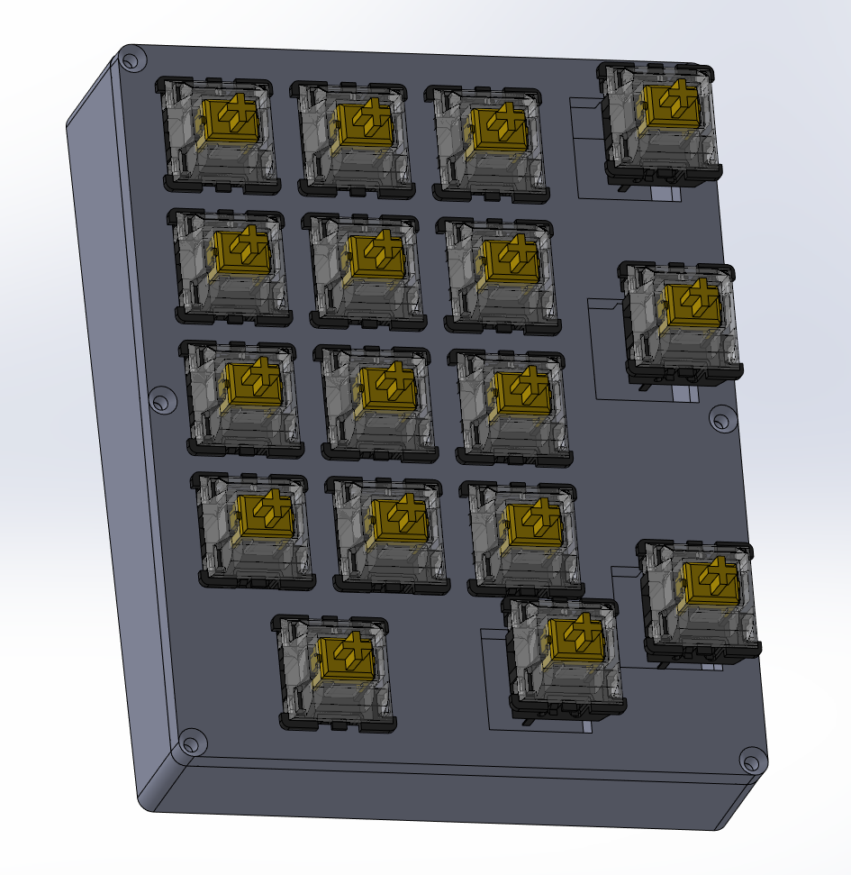
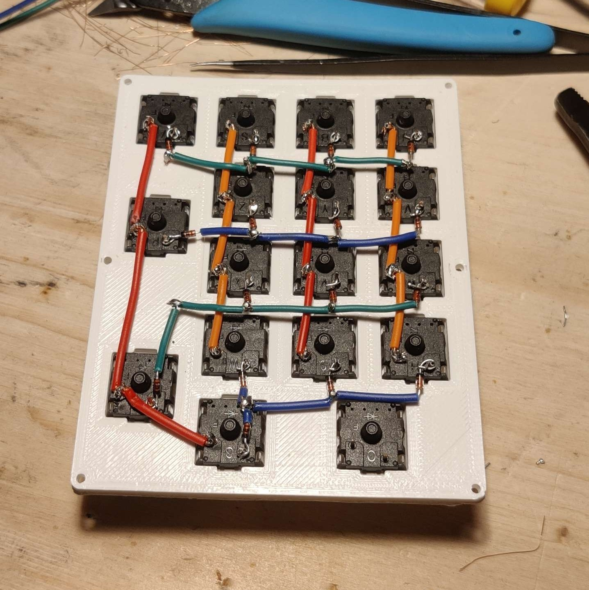
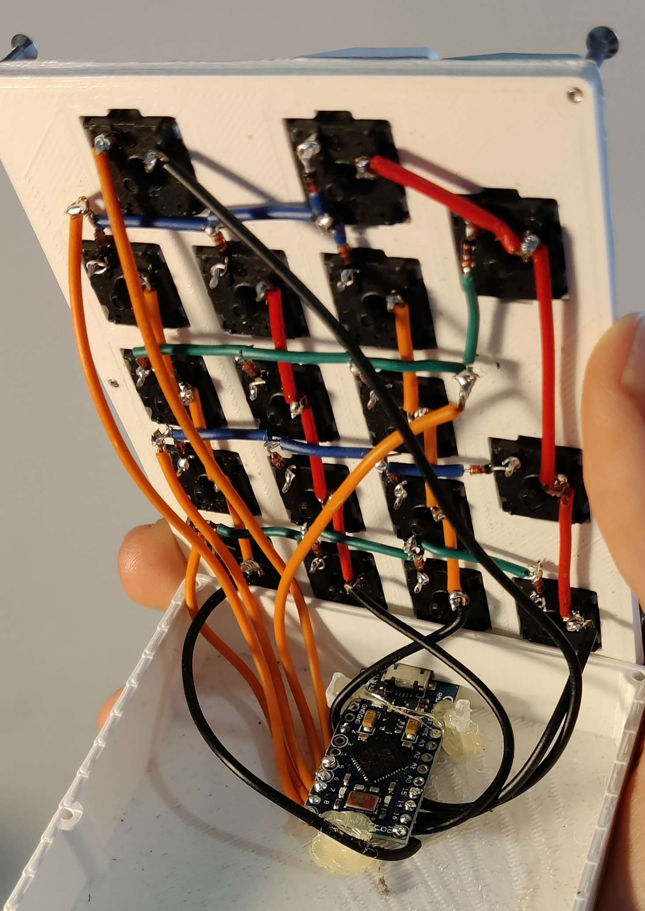

# Projet NumPadDIY
Ce projet m'a conduit à réaliser un pavé numérique filaire pour mon bureau.
Il s'agit d'un pavé numérique complet avec la touche verr/num fonctionnelle et l'anti-ghosting.

Tenter la réalisation de ce projet vous demandera des compétences de base en soudure, impression 3D et programmation C. Bien sûr, assurez-vous également d'avoir une imprimante 3D et un poste à souder.

Fonctionnalité:
- Touche Pavé numérique
- Anti-ghosting
- port Micro USB

Matériel:
- 1 Arduino Pro Micro 
- 17 switch de clavier
- 17 diode
- Les touches correspondants au pavé numérique d'un clavier
- 6 vis M1
- Du câble
- Du filament 3D

## Étape 1 - impression 3D

La première chose à faire est d'imprimer la coque en 3D.
Elle ne comporte que 2 parties plutôt faciles à imprimé, j'ai utilisé du PLA pour ma part
Mon paramétrage d'imprimante devait être une d'épaisseur de 0.2 mm sans support.
L'imprimante depuis laquelle j'ai fait la coque est une anet a8.




Les fichier STL: https://github.com/switch-bls/NumPadDIY/tree/main/STL-3d-model

Les fichiers SolidWorks:  https://github.com/switch-bls/NumPadDIY/tree/main/SW-3d-model

## Étape 2 - Placer les switch

Placez simplement tout les switch dans le même sens sur la grille.



Vous avez désormais une grille de bouton relier à rien. Maintenant on passe aux choses plus sérieuses.

## Étape 3 - Souder

C'est là que ça se complique, armez vous de patience pour l'étape la plus fastidieuse de ce projet (la soudure).

Tout d'abord il faut placer une diode sur chaque switche, toujours sur le même pin pour la gestion de l'anti-ghosting.

Nous allons vouloir relier les switch de notre clavier en une matrice. C'est-à-dire en ligne et en colonne, de sorte à en minimiser le nombre. Ce n'est pas grave si les lignes et les colonnes ne sont pas de la même taille.

Ce site explique en détaille l'intérêt de ce travaille:
- https://pcbheaven.com/wikipages/How_Key_Matrices_Works/


Voici mon résultat:



Une matrice de 4*4+1.

Pour finir reliez chaque ligne et chaque colonne une fois à un pin digital de votre carte Arduino Pro Micro de sorte à laisser suffisamment de mou pour pouvoir tout positionner dans la boite.



Et voilà c'est fini pour la soudure!

## Étape 4 - Progrogrammer

Le code est le fichier ```code_keyboard.ino``` du projet.
Ce code n'est pas de moi, ***MAIS*** j'ai oublié la source dont il provient donc dsl pour l'auteur.

Si votre câblage est différent du mien, il va falloir adapter votre programme en conséquence.
Pas de panique, il s'agit de redéfinir quelque variable.

### Nombre de ligne et colonne
Placer le nombre de vos lignes et colonnes ici.
Ma matrice comportait 4x4+1 ce qui fait 5x5 pour ma part.

La variable *LAYERS* sert à définir différentes configuration de touches pour un même clavier mais elle n'est pas utile pour ce projet.

```C++
//Matrix Setup
const int LAYERS = 3;
const int ROWS = 5;
const int COLUMNS = 5;
```

### Définition des pins

Changez les numéros des pins pour ceux que vous avez connectés à votre micro controller. L'ordre n'est pas important.

```C++
//Input pins,
int ColPins[COLUMNS] = {8,9,7,6,5};
int RowPins[ROWS] = {14,2,16,15,10};
```

### Assigner les touches

Enfin il est temps d'assigner les touches de votre clavier à des actions dans le code (écrire des caractères). 

Tout d'abord il vous faudra initialiser un tableau de la taille de votre matrice.
Puis il faudra verifier ce que l'on appelle le scan-code de chaque touche en essayant de voir à quelle touche correspond quelle valeur.

Ici, le scan code est écrit en binaire, si vous le pouvez, faite le en hexadécimale se sera plus simple.

Pour connaître le scan-code des touche:
- https://forum.arduino.cc/t/numpad-keys/257542/4
- http://www.quadibloc.com/comp/scan.htm


```C++
const unsigned int Keymap[LAYERS][ROWS][COLUMNS] = 
{
  {//0 Raised layer
    {
      222,//  -
      235, // .
      223, // +
      224, // Enter
      NO_ACTION //  
    },
    {
      221, // *
      227, // 3
      233, // 9
      230, // 6
      NO_ACTION  // 
    },
    {
      220, // //
      226, // 2
      232, // 8
      229, // 5
      NO_ACTION  //
    },
    {
      NO_ACTION, //
      NO_ACTION, // 
      NO_ACTION, //
      NO_ACTION, // 
      234, // 0
    },
    {
      219,  // META
      225,  // 1
      231, // 7
      228,  // 4
      NO_ACTION,  
    }
   }
 };
```

## Étape 4 - Assemblage finale

Une fois cette opération achevéé, il ne reste qu'à coller la carte à l'emplacement prévu. J'ai utilisé du pistolet à colle pour ça.

Vissez le tout avec des vis M1 et placez vos keyCap sur les switches correspondant si ce n'est pas déjà fait et voilà!

Votre Pavé Numérique est opérationnel.

## Sources utiles

- https://pcbheaven.com/wikipages/How_Key_Matrices_Works/
- http://www.philipstorr.id.au/pcbook/book3/scancode.htm
- http://www.quadibloc.com/comp/scan.htm
- https://forum.arduino.cc/t/numpad-keys/257542/4

<style>
img{max-width:500px;}
img{min-width:300px;}
img{width:49%;}
</style>
